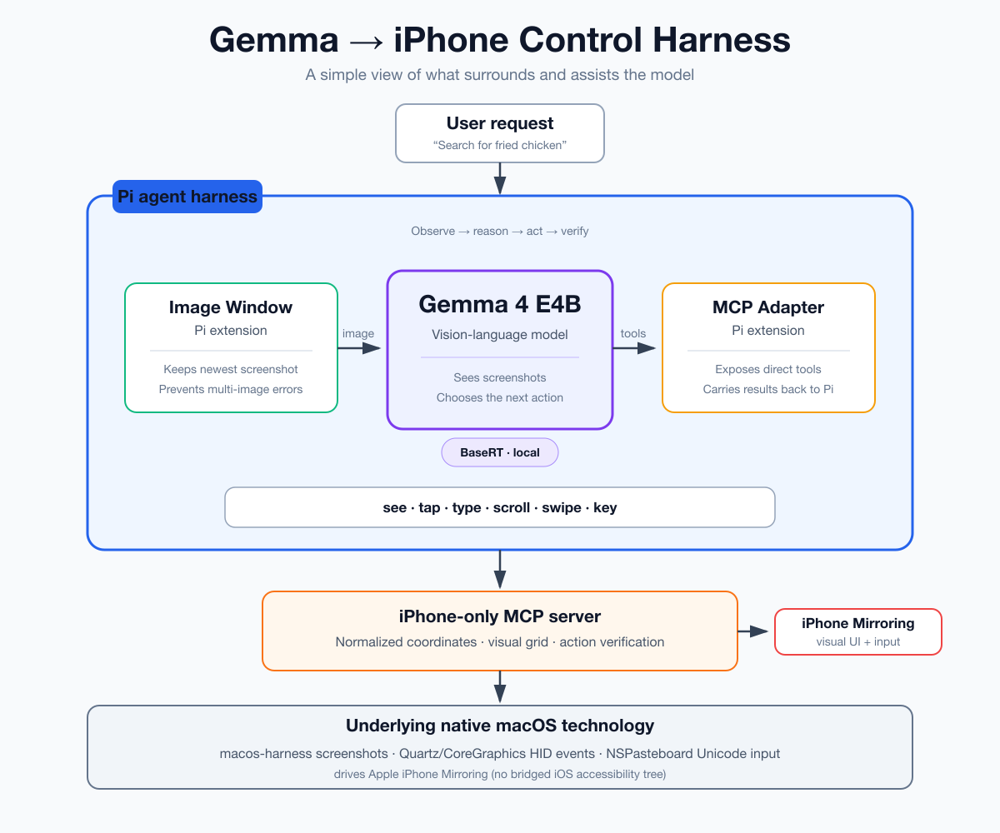

# Pi iPhone Mirroring

A self-contained [Pi](https://pi.dev) package that lets an image-capable model
control Apple's **iPhone Mirroring** app through a deliberately small,
vision-first tool surface.



## What it provides

Six iPhone-only tools are exposed directly to Pi:

| Tool | Purpose |
| --- | --- |
| `see_iphone` | Capture a screenshot with a normalized coordinate grid. |
| `tap_iphone` | Tap a point in normalized 0–1000 coordinates. |
| `type_iphone` | Type focused text, including Unicode through native paste. |
| `scroll_iphone` | Perform a continuous trackpad-style scroll gesture. |
| `swipe_iphone` | Drag between two normalized points. |
| `key_iphone` | Send keys and chords such as Return or Cmd+A. |

The package also includes:

- A Pi system-prompt extension that explains the coordinate and verification rules.
- An image-window extension for providers such as BaseRT that accept only one image per request.
- An embedded Python MCP server—no separate clone or `.mcp.json` is required.
- Automatic post-action screenshots, tap markers, and visual-change reporting.

## Requirements

- macOS with iPhone Mirroring available.
- [Pi](https://pi.dev) installed.
- [`uv`](https://docs.astral.sh/uv/) installed and on `PATH`.
- Accessibility and Screen Recording permission granted to the terminal that runs Pi.
- An image-capable model configured in Pi.

The first launch uses `uv` to create the package-local Python environment from
the committed lockfile.

## Install

From GitHub:

```bash
pi install git:github.com/aniruddha-adhikary/pi-iphone-mirroring
```

For development from a local checkout:

```bash
pi install /absolute/path/to/pi-iphone-mirroring
```

Then start Pi normally and select an image-capable model:

```bash
pi
```

The MCP server starts eagerly, and the six tools appear directly in Pi. Use
`/mcp status` if you need to inspect the connection.

## Using local Gemma through BaseRT

This package does not install a model or inference server. To reproduce the
original setup, install the BaseRT Pi provider separately, start `basert serve`,
and select:

```text
basert/basecompute/gemma-4-E4B-it
```

Any Pi model that supports image input and tool use can use the harness.

## Coordinate model

Coordinates are normalized independently on each axis:

```text
(0, 0)                         (1000, 0)
   ┌───────────────────────────────┐
   │                               │
   │          iPhone image         │
   │                               │
   └───────────────────────────────┘
(0, 1000)                    (1000, 1000)
```

`see_iphone` draws a grid every 100 units. Actions recapture the current frame
before mapping coordinates into the actual macOS window bounds.

## Native implementation

- **Capture:** `macos-harness` window screenshots
- **Tap:** physical cursor mapping plus Quartz HID mouse events
- **Scroll:** continuous phased Quartz session-tap events
- **Unicode:** native `NSPasteboard` plus a real HID Command+V sequence
- **Transport:** MCP over stdio through `pi-mcp-adapter`

There is no bridged iOS accessibility tree; observation is visual.

## WeChat scrolling

In a WeChat conversation:

- Negative vertical amount moves toward older messages.
- Positive vertical amount moves toward newer messages.
- Anchor around `(500, 500)` on plain chat background.
- Avoid anchoring on a message bubble.

## Safety

This package can generate real mouse and keyboard input and runs with the full
permissions of your Pi process. Review the source before installation. Keep a
human in the loop for purchases, messages, deletion, authentication, and other
high-impact actions.

## Development

```bash
npm install
npm test
```

The editable Mermaid source is at [`docs/architecture.mmd`](docs/architecture.mmd).

## License

MIT
